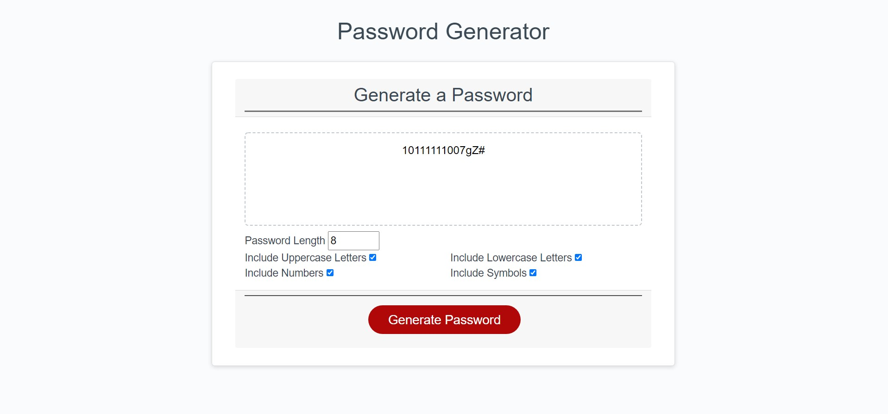

# Password-Generator

## Description
The objective was to have the user be able to generate a passworword with the length between 8 characters and 128 chaeacters. The password needs to contain numbers, uppercase, lowercase, and special characters.

## Resources
W3 Schools
Stackoverflow
http://www.net-comber.com/charset.html
Bootcamp Activities 12, 22, 33

## Screenshots

